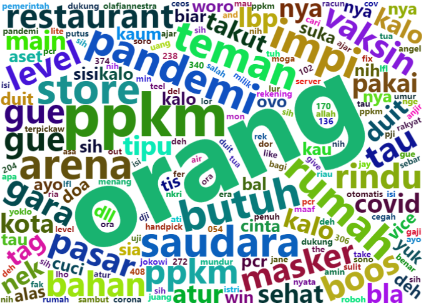

# Penerapan Machine Learning Terhadap Analisis OCEAN Mengenai Opini Masyarakat Mengenai PPKM di Media Sosial


[](https://www.r-project.org/)



Repository dari laporan PKL dengan judul

> [Penerapan Machine Learning Terhadap Analisis OCEAN Mengenai Opini Masyarakat Mengenai PPKM di Media Sosial](./Penerapan%20Machine%20Learning%20Terhadap%20Analisis%20OCEAN%20Mengenai%20Opini%20Masyarakat%20Mengenai%20PPKM%20di%20Media%20Sosial.pdf)

## [Dataset](./data)

Indonesian Twitter dataset dengan topik PPKM bulan Juli - September 2021. Data dapat diakses langsung secara online dengan format link berikut:

`https://raw.githubusercontent.com/Hyuto/pkl-project/master/data/<NAMA FILE>`

## [Notebook](./notebook)

Notebook yang digunakan untuk mengolah data.

1. [`Sampling.Rmd`](./notebook/Sampling.Rmd)

   Notebook yang digunakan untuk melakukan sampling terhadap dataset sehingga data yang akan
   diteliti berjumlah lebih sedikit untuk dilakukan `labelling`.

2. [`Main Netebook.Rmd`](./notebook/Main%20Notebook.Rmd)

   Notebook utama yang digunakan untuk melakukan pengolahan data untuk penelitian.

3. [`Visualization.Rmd`](./notebook/Visualization.Rmd)

   Notebook yang digunakan untuk visualisasi.

## Script

- [`keywords-based-OCEAN.R`](keywords-based-OCEAN.R) : adalah script untuk mencari OCEAN pada data text berdasarkan
  keywords yang telah ditetapkan.

  **Penggunaan**

  ```bash
  rscript keywords-based-OCEAN.R -p <PATH-DATA>
  ```
